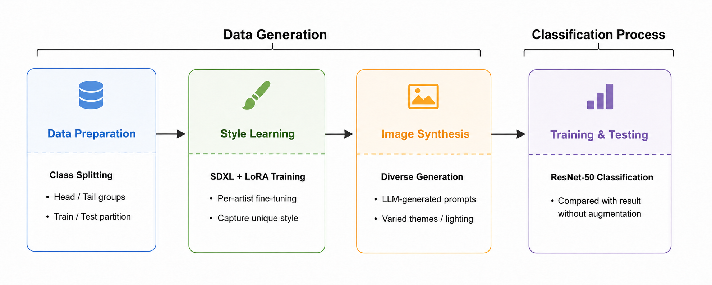

# Artist Authorship Attribution

50-class artist attribution from painting images. DS2 Group #166 (Yiqiao Huang, Lixuan Wei, Ruyi Yang, Tian Xia).

**Dataset:** [Best Artworks of All Time](https://www.kaggle.com/datasets/ikarus777/best-artworks-of-all-time/data) — 50 artists, 8,355 images.

## Pipeline

## Code Structure

### Main notebook

| File | Description |
|---|---|
| `cs1090b_ms4_main_group166.ipynb` | **Main notebook** — end-to-end pipeline: data loading, EDA summary, baseline training, LoRA augmentation, augmented experiments, final results |

### Supporting notebooks

| File | Description |
|---|---|
| `nb1_eda.ipynb` | Full exploratory data analysis (class imbalance, genre/nationality distributions, t-SNE) |
| `nb2_baseline.ipynb` | Baseline classification experiments (ResNet-18, ViT-B/16, CLIP, EfficientNet-B0) |
| `nb3_lora_augmented.ipynb` | Full augmentation experiments: naive vs. corrected sampler sweep, Canny+ControlNet comparison |

### Data generation (`data_generation_inference/`)

| File | Description |
|---|---|
| `nb4_augmentation_colab.ipynb` | Augmentation prototype (early-stage Colab notebook) |
| `nb5_train_and_generate_colab.ipynb` | DreamBooth-LoRA training per artist (Colab, calls Diffusers `train_dreambooth_lora_sdxl.py`) |
| `Phase1_Augmentation_LoRA_Text2Img.py` | Batch generation: SDXL + LoRA, text prompts |
| `Phase1_Augmentation_LoRA_ControlNet.py` | Batch generation: SDXL + LoRA + Canny ControlNet |
| `Phase1_Augmentation_RawSDXL_Text2Img.py` | Ablation: raw SDXL without LoRA, text prompts |
| `Phase1_Augmentation_RawSDXL_ControlNet.py` | Ablation: raw SDXL without LoRA, ControlNet |
| `download_lora_ckpts.py` | Download per-artist LoRA checkpoints from Google Drive |
| `download_landscape_photos.py` | Download reference landscape photos for ControlNet input |
| `run_all_gpus_lora.sh` | Multi-GPU parallel generation (4 GPUs) |
| `make_collages.py` | Generate preview collages for visual inspection |

### Pre-trained assets

LoRA checkpoints and generated images are hosted on [Google Drive](https://drive.google.com/drive/folders/1l9Gn_v0vcHLlWXGybwgBqU7qCOfCxk5Y). The main notebook downloads them automatically in §5.1.

### Dependencies

See `requirements.txt`. On Colab, the main notebook installs everything via `%pip install` at the top.

## Slides

[Milestone 2](https://docs.google.com/presentation/d/1Yi-8sNqPw_74J4dzwzK7wS77EnGcdfKkU6x6f4AiYfM/edit) ·

[Milestone 3](https://docs.google.com/presentation/d/1Ckgo10r7gyPSLdDYkWb_ZmAkyDMMTDYeBELNgo0ZGvg/edit)
